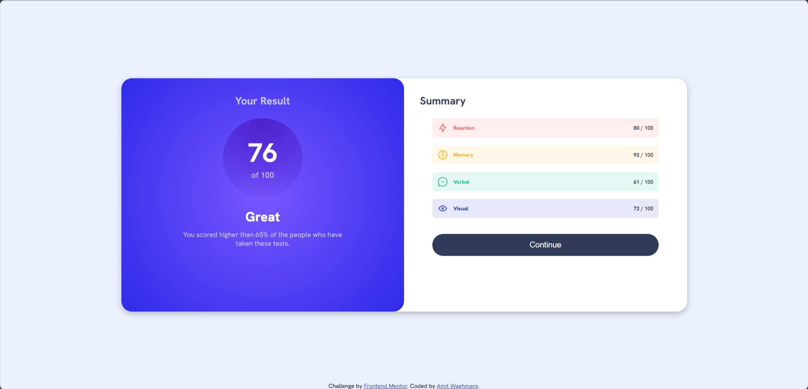

# Frontend Mentor - Results summary component solution

This is a solution to the [Results summary component challenge on Frontend Mentor](https://www.frontendmentor.io/challenges/results-summary-component-CE_K6s0maV). Frontend Mentor challenges help you improve your coding skills by building realistic projects. 

## Table of contents

- [Overview](#overview)
  - [The challenge](#the-challenge)
  - [Screenshot](#screenshot)
  - [Links](#links)
- [My process](#my-process)
  - [Built with](#built-with)
  - [What I learned](#what-i-learned)
  - [Continued development](#continued-development)
- [Author](#author)

## Overview

### The challenge

Users should be able to:

- View the optimal layout for the interface depending on their device's screen size
- See hover and focus states for all interactive elements on the page
- **Bonus**: Use the local JSON data to dynamically populate the content

### Screenshot

### Links

- Solution URL: [Frontend-mentor solution](https://www.frontendmentor.io/solutions/results-summary-card-gkNGyh3OKK)
- Live Site URL: [Click to view the live site](https://results-summary-card-eight.vercel.app/)

## My process

### Built with

- Semantic HTML5 markup
- CSS custom properties
- Flexbox
- CSS Grid
- Mobile-first workflow

### What I learned

This project was a revision of my learnings of HTML, CSS, and making the page responsive. Even though the page is not upto the mark still I decided to go with it becuase I just wanted to revise the concepts but I will make sure that from next projects there will be no such issues!

### Continued development

Will try to perfect the responsiveness of the page.

## Author

- Frontend Mentor - [@waghmare-amit](https://www.frontendmentor.io/profile/waghmare-amit)
- Twitter - [@waghmareamit24](https://www.twitter.com/waghmareamit24)

